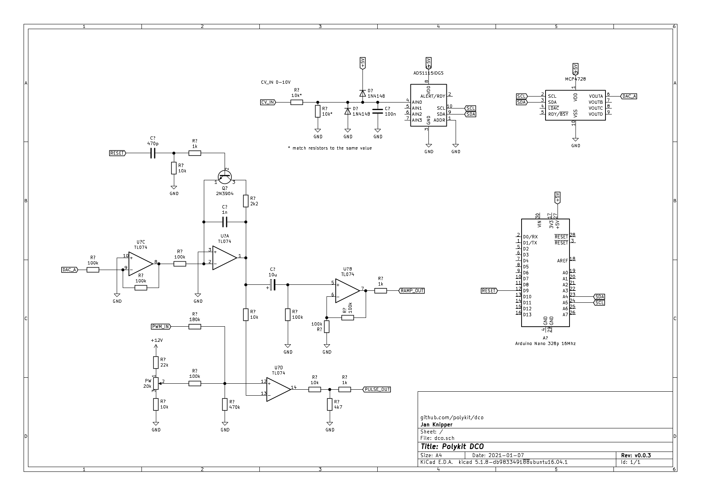

# Polykit DCO

This repository contains the schematics and source code for an Arduino Nano based DCO (digitally controlled analog oscillator). Schematics are roughly based on the Juno 106, voltage for amplitude compensation comes from the DAC MCP4728. It produces a highly accurate frequency 5Vpp ramp over several octaves on the output. For frequency control it uses timer interrupts on the full 16 mhz range. The reset signal is sent when the 16-bit counter overflows and also handles multiple overflows on low frequencies.

## Todo

- add MIDI input
- add voltage control
- control multiple oscillators with one Arduino

## References

https://github.com/petegaggs/MIDI-controlled-oscillator

https://blog.thea.codes/the-design-of-the-juno-dco/

https://electricdruid.net/roland-juno-dcos/

https://learn.adafruit.com/adafruit-mcp4728-i2c-quad-dac/arduino

https://ww1.microchip.com/downloads/en/DeviceDoc/22187E.pdf

https://www.robotshop.com/community/forum/t/arduino-101-timers-and-interrupts/13072

http://newt.phys.unsw.edu.au/jw/notes.html
